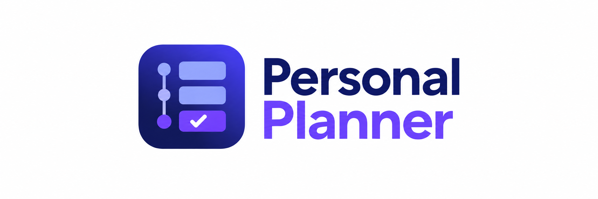
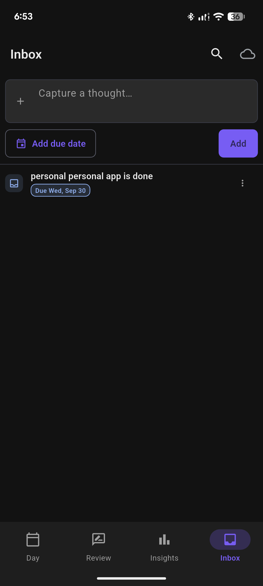
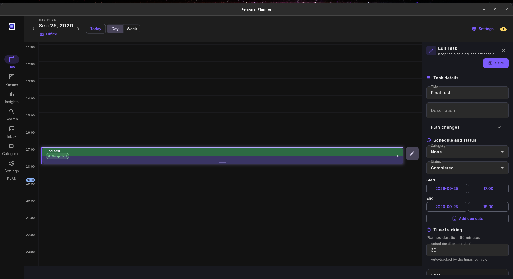
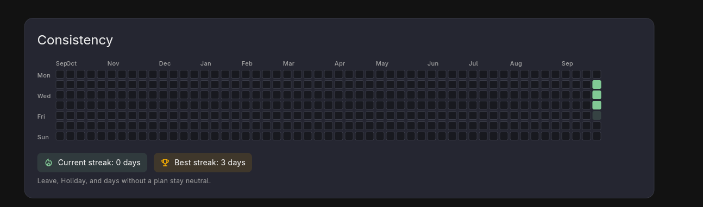
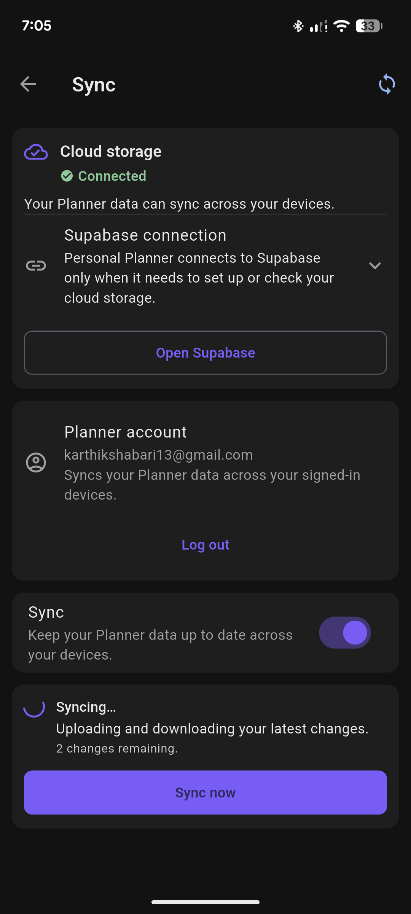
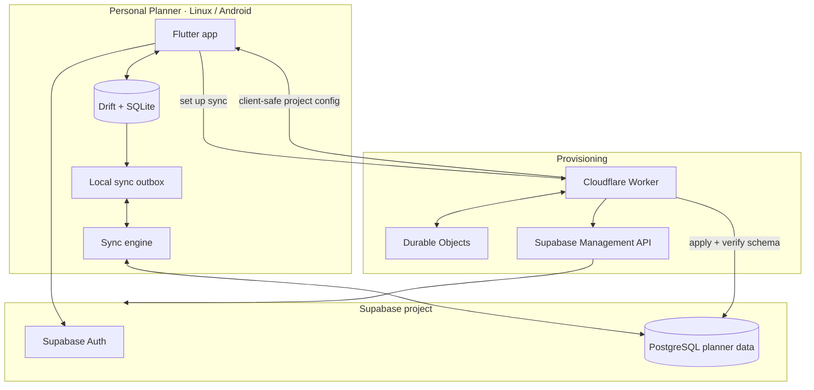

<p align="center">
  
</p>

# Personal Planner

A local-first planner for Linux and Android that keeps your schedule, time tracking, history, reviews, and sync together.

<p>
  
  
  
</p>

## What is Personal Planner?

Personal Planner is the planner I wanted for myself.

I wanted something that worked well for planning today, but I also wanted yesterday to remain useful.

If I open the app a few weeks later, I should still be able to understand what I planned, what I completed, what got moved, how much time I actually spent, and how that day or week went. Because this makes me tell whether i was actually productive :)

Personal Planner keeps those things together.

You can plan work on a timeline, keep things in an Inbox before they have a place in the schedule, track time directly from the plan, look back through previous days and weeks, write reviews, and use Insights to understand longer-term patterns.

It runs on **Linux and Android**. The app works from a local database, so everyday planning continues without an internet connection, while sync keeps your devices connected through Supabase.

## Why I built it

Before building Personal Planner, I tried quite a few productivity apps.

[Super Productivity](https://github.com/super-productivity/super-productivity) came closest to what I was looking for. I liked having planning, time tracking, tasks, and calendar integrations in the same application.

But after using planners for a while, I realised that planning the next thing was only half of what I wanted.

I kept wanting to go backwards.

What did I actually work on last Tuesday? Did I already finish something? What got pushed to another day? Did the two-hour block I planned actually take two hours? How did this week go compared with the last one?

That history mattered to me just as much as tomorrow's schedule.

I also tried [Planify](https://github.com/alainm23/planify). It feels natural on Linux and has a clean task-management experience, but the way I wanted to work was more centred around the **day itself** — planning it, working through it, and being able to come back to it later.

[Vikunja](https://vikunja.io/) was another option I explored. Self-hosting itself was not a problem for me; I was comfortable with that. The bigger issue was that its feature set and workflow still were not what I wanted from a personal day planner.

None of those are bad applications. They solve their own problems well, and several of their features overlap with Personal Planner today.

Trying them mostly helped me work out what I was actually looking for.

I wanted previous days to remain part of the planner instead of fading into a completed-task archive.

I wanted daily and weekly reviews beside the work they describe.

I wanted planned time and actual time in the same place.

I wanted a simple way to see whether I had really been consistent over the last few weeks and months.

And I wanted all of that on my Linux laptop and Android phone, with sync, without turning Personal Planner into a subscription service.

That is made me to start building an applciation

## What it does

### Plan around the day

The main screen is built around the day.

If something already has a time, put it directly on the schedule. If it is only a thought you do not want to lose, capture it first and decide where it belongs later.

You can move between day and week views, drag work to another time, resize scheduled blocks, handle scheduling conflicts, create recurring activities, use reusable templates, organise work with categories, and move unfinished work forward without losing its earlier context.

Undo and redo are there for the inevitable moments when the plan changes again.

<p align="center">
  
</p>

<p align="center">
  <sub>Capture something before it slips away, then decide where it belongs.</sub>
</p>

### Track the time you actually spend

Timers stay connected to the work you planned.

Start, pause, resume, and stop a timer directly from a task. Personal Planner keeps the time you expected to spend and the time you actually spent close together.

That distinction matters to me. A two-hour block on a calendar and two hours of actual focused work are not necessarily the same thing.

Timer state persists across normal app use, and timer controls are available through platform notifications where supported.

<p align="center">
  
</p>

<p align="center">
  <sub>The plan is useful, but seeing what actually happened matters just as much.</sub>
</p>

### Go back to previous days

This is the part of Personal Planner I care about the most.

A finished day does not become a dead page.

You can move back through previous days and weeks and see what was planned, completed, moved, skipped, or carried forward.

Daily and weekly reviews sit beside that history. When you write about how a week went, the actual week is still there for context instead of the reflection living in a completely separate journal.

Finishing something should not make everything around it useless.

### See the pattern over time

A few individual days rarely tell the whole story.

Personal Planner has a consistency view inspired by GitHub's contribution grid, so you can see activity across a much longer period instead of judging progress from one particularly good or bad day.

Gaps, streaks, and longer periods of consistency become much easier to notice.

Insights also brings together weekly activity and planned-versus-actual time, turning the history already in the planner into something you can actually use.

<p align="center">
  
</p>

<p align="center">
  <sub>A longer view makes consistency easier to understand than a streak number alone.</sub>
</p>

### Use the same planner on Linux and Android

I wanted Personal Planner in the two places where I would actually use it: my Linux laptop and my Android phone.

The layout adapts to both rather than treating one as a smaller copy of the other.

Most planner work happens against the local database. Losing connectivity does not stop you from changing the plan, running a timer, or looking through earlier days.

If a device goes offline while sync is connected, your work stays local. When connectivity returns, the sync engine can continue processing the changes that have not reached the other device yet.

<p align="center">
  
</p>

<p align="center">
  <sub>Keep working offline; sync can catch up when the connection returns.</sub>
</p>

## How it works

The important architectural choice in Personal Planner is that the app remains useful from its local state.

Supabase adds identity and cross-device synchronization. Cloudflare handles the work required to prepare that Supabase environment.

Those are separate responsibilities.



### The app stays local first

**Drift and SQLite are the everyday working store.**

Moving something on the timeline, completing work, starting a timer, or opening an earlier day does not need to wait for a server.

The app writes locally first.

Changes that still need to be synchronized are kept in a local outbox. If connectivity disappears, those pending operations remain on the device and can continue once the connection comes back.

That is what allows the planner itself to keep working even when sync temporarily cannot.

### Supabase connects the devices

Supabase is the synchronized side of the system.

**Supabase Auth** identifies the signed-in account.

**PostgreSQL** stores the planner data that needs to be available across devices.

The Linux and Android clients still keep their own local working copies. Supabase gives them a common place to exchange synchronized changes rather than becoming a remote database that the interface has to wait on for every interaction.

The project used for sync is associated through the Personal Planner provisioning flow rather than putting every Personal Planner user's planner rows into one shared application database.

### Cloudflare prepares the project

The Cloudflare Worker handles a different part of the problem: getting Supabase ready for Personal Planner.

A usable Supabase setup needs more than an empty project. The expected database schema has to exist, migrations have to be applied, access rules need to be correct, and the app needs the right client configuration.

Doing that manually would mean asking someone to create and configure the project themselves, run the migrations, verify the result, and then copy the correct values back into Personal Planner.

The Worker turns that into the setup flow inside the app.

It can authorize the Supabase Management access required for provisioning, find a compatible Personal Planner project that already exists, reuse it when appropriate, create one when necessary, apply the required migrations, and verify that the resulting schema is ready for sync.

Provisioning is not always completed in one request. Project creation, authorization, and migration can span several steps, so **Cloudflare Durable Objects** keep the transaction state coordinated while that work is happening.

Once the project is ready, the app receives the client-safe information it needs and continues with normal sign-in and sync.

The Worker does **not** sit in the middle of everyday planner traffic.

After provisioning, normal planner changes move directly between the app's sync engine and Supabase.

In short:

* **Flutter** provides the Linux and Android app.
* **Drift + SQLite** keep everyday planner use local.
* **The sync engine and outbox** carry changes safely between devices.
* **Supabase Auth + PostgreSQL** provide identity and synchronized planner storage.
* **Cloudflare Workers + Durable Objects** make project provisioning and migration manageable.

## Build it yourself

You can run Personal Planner locally without configuring Supabase or Cloudflare.

### Requirements

Install Flutter and check that your development environment is ready:

```bash
flutter doctor -v
```

Clone the repository and install the Flutter packages:

```bash
git clone https://github.com/Karthikshabari/PersonalPlanner.git
cd PersonalPlanner

flutter pub get
```

### Linux

On Fedora, install the Linux desktop build dependencies:

```bash
sudo dnf install clang cmake ninja-build pkgconf-pkg-config gtk3-devel
```

Run Personal Planner:

```bash
flutter run -d linux
```

Build the Linux release:

```bash
flutter build linux --release
```

The release bundle is created under:

```text
build/linux/<architecture>/release/bundle/
```

### Android

Connect an Android phone with USB debugging enabled or start an emulator:

```bash
flutter devices
```

Run Personal Planner on the device:

```bash
flutter run -d <ANDROID_DEVICE_ID>
```

Build a debug APK:

```bash
flutter build apk --debug
```

The APK is written under:

```text
build/app/outputs/flutter-apk/
```

For a release build:

```bash
flutter build apk --release
```

Use your own Android signing configuration for release builds. Keystores, signing passwords, and `android/key.properties` should never be committed to the repository.

## Set up sync

There are two useful paths when running your own build.

### Connect an existing Supabase project

If you already have a Supabase project with the Personal Planner schema applied, copy the example configuration:

```bash
cp supabase.example.json supabase.local.json
```

Add the project's client configuration:

```json
{
  "SUPABASE_URL": "https://<YOUR_PROJECT>.supabase.co",
  "SUPABASE_PUBLISHABLE_KEY": "<YOUR_PUBLISHABLE_KEY>"
}
```

Then run:

```bash
flutter run -d linux \
  --dart-define-from-file=supabase.local.json
```

The project URL and publishable key are values intended for the client.

Supabase Management tokens, OAuth client secrets, secret/service-role credentials, database passwords, and signing credentials are not. Keep those outside the Flutter application and out of Git.

### Use Personal Planner's provisioning flow

To use the same setup flow as the application, deploy the provisioning Worker and point the Flutter build to it:

```bash
flutter run -d linux \
  --dart-define=PROVISIONING_BASE_URL=https://<YOUR_WORKER_URL>
```

The Worker lives under:

```text
provisioning/
```

Install its dependencies:

```bash
cd provisioning
npm ci
```

Create the local Worker configuration:

```bash
cp .dev.vars.example .dev.vars
```

The Worker uses server-side configuration such as:

```text
OAUTH_SESSION_KEY
SUPABASE_OAUTH_CLIENT_ID
SUPABASE_OAUTH_CLIENT_SECRET
SUPABASE_OAUTH_REDIRECT_URI
```

Keep those values in the Worker environment, never in Flutter `--dart-define` values.

Before deployment:

```bash
npm run check
npm run deploy:dry
```

After the Cloudflare environment and Supabase OAuth callback are configured, deploy the Worker and use its HTTPS URL as `PROVISIONING_BASE_URL`.

From inside Personal Planner, that infrastructure becomes a much simpler setup: connect your Supabase account, reuse a compatible project or create one, let the provisioning service prepare and verify it, then sign in and start syncing.

Supabase and Cloudflare currently provide free tiers that can be practical for a small personal workload. Their quotas and pricing are controlled by those services and may change over time.

---
